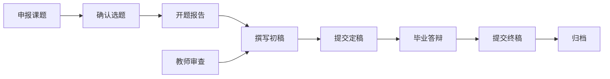

???+ warning 注意
    本文档撰写于 2023 年 7 月, 且带有作者相当强烈主观性, 请谨慎看待本文观点.

你的时间十分宝贵！请把精力花在更重要的事情上！

从毕业的难度上看, 广东财经大学的毕业难度可以说是几乎不存在的. 不管你是本科混了四年, 还是经过了自己的努力取得了一部分成绩, 完成一份毕业设计对于你而言应当也不是什么难事.

### 基本流程

如果想要速通

毕业设计的提交都是在学校的维普上进行的, 你可以在 维普毕业设计论文

毕业设计的流程大致如下:

1. 确定选题: 在大四上学期的 11-12 月. 在此期间, 你需要确定你的毕业论文选题, 并且在学校系统中提交相关信息.
2. 开题报告: 
3. 撰写初稿:
4. 提交定稿:
5. 毕业答辩:
6. 提交终稿:
7. 归档: 

参考维普系统的流程图, 学生速通毕业设计需要通过以下流程:

### 确定选题

### 开题报告

### 撰写初稿

开题报告提交后, 你就可以开始着手撰写你的毕业论文初稿了. 一般而言, 如果你选择了一个工作量相对合适的选题, 从思路上来说, 撰写一份选题的

### 提交定稿

### 毕业答辩

### 提交终稿

### 归档

### 参考文档

